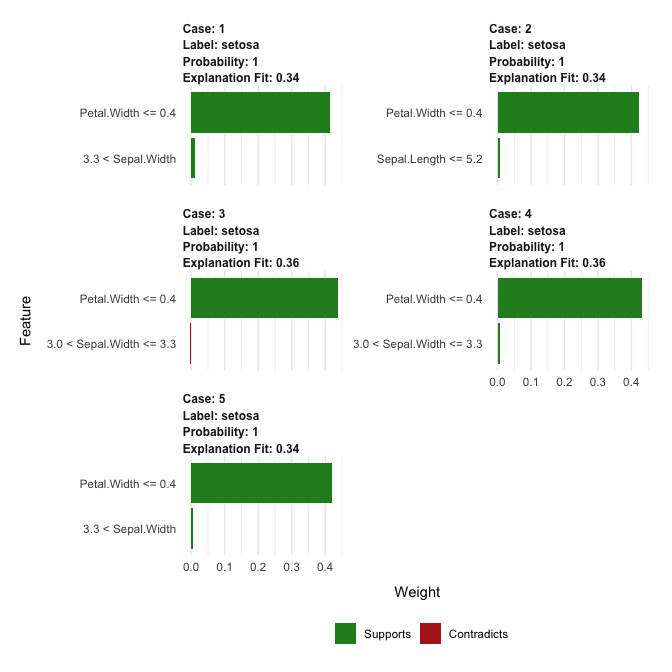

<!-- README.md is generated from README.Rmd. Please edit that file -->

# lime 

[](https://travis-ci.org/thomasp85/lime)
[](https://ci.appveyor.com/project/thomasp85/lime)
[](https://CRAN.R-project.org/package=lime)
[](https://CRAN.R-project.org/package=lime)
[](https://codecov.io/github/thomasp85/lime?branch=master)

> There once was a package called lime,
> 
> Whose models were simply sublime,
> 
> It gave explanations for their variations,
> 
> one observation at a time.

*lime-rick by Mara Averick*

-----

*This is an R port of the Python lime package
(<https://github.com/marcotcr/lime>) developed by the authors of the
lime (Local Interpretable Model-agnostic Explanations) approach for
black-box model explanations. All credits for the invention of the
approach goes to the original developers.*

The purpose of `lime` is to explain the predictions of black box
classifiers. What this means is that for any given prediction and any
given classifier it is able to determine a small set of features in the
original data that has driven the outcome of the prediction. To learn
more about the methodology of `lime` read the
[paper](https://arxiv.org/abs/1602.04938) and visit the repository of
the [original implementation](https://github.com/marcotcr/lime).

The `lime` package for R does not aim to be a line-by-line port of its
Python counterpart. Instead it takes the ideas laid out in the original
code and implements them in an API that is idiomatic to R.

## An example

Out of the box `lime` supports a long range of models, e.g. those
created with caret, parsnip, and mlr. Support for unsupported models are
easy to achieve by adding a `predict_model` and `model_type` method for
the given model.

The following shows how a random forest model is trained on the iris
data set and how `lime` is then used to explain a set of new
observations:

``` r
library(caret)
library(lime)

# Split up the data set
iris_test <- iris[1:5, 1:4]
iris_train <- iris[-(1:5), 1:4]
iris_lab <- iris[[5]][-(1:5)]

# Create Random Forest model on iris data
model <- train(iris_train, iris_lab, method = 'rf')

# Create an explainer object
explainer <- lime(iris_train, model)

# Explain new observation
explanation <- explain(iris_test, explainer, n_labels = 1, n_features = 2)

# The output is provided in a consistent tabular format and includes the
# output from the model.
explanation
#> # tibble [10 × 13]
#>    model_type case  label label_prob model_r2 model_intercept
#>    <chr>      <chr> <chr>      <dbl>    <dbl>           <dbl>
#>  1 classific… 1     seto…          1    0.340           0.263
#>  2 classific… 1     seto…          1    0.340           0.263
#>  3 classific… 2     seto…          1    0.336           0.259
#>  4 classific… 2     seto…          1    0.336           0.259
#>  5 classific… 3     seto…          1    0.361           0.258
#>  6 classific… 3     seto…          1    0.361           0.258
#>  7 classific… 4     seto…          1    0.364           0.247
#>  8 classific… 4     seto…          1    0.364           0.247
#>  9 classific… 5     seto…          1    0.343           0.256
#> 10 classific… 5     seto…          1    0.343           0.256
#> # ... with 7 more variables: model_prediction <dbl>, feature <chr>,
#> #   feature_value <dbl>, feature_weight <dbl>, feature_desc <chr>,
#> #   data <list>, prediction <list>

# And can be visualised directly
plot_features(explanation)
```

<!-- -->

`lime` also supports explaining image and text models. For image
explanations the relevant areas in an image can be highlighted:

``` r
explanation <- .load_image_example()

plot_image_explanation(explanation)
```

<!-- -->

Here we see that the second most probably class is hardly true, but is
due to the model picking up waxy areas of the produce and interpreting
them as wax-light surface.

For text the explanation can be shown by highlighting the important
words. It even includes a `shiny` application for interactively
exploring text models:


## Installation

`lime` is available on CRAN and can be installed using the standard
approach:

``` r
install.packages('lime')
```

To get the development version, install from GitHub instead:

``` r
# install.packages('devtools')
devtools::install_github('thomasp85/lime')
```
